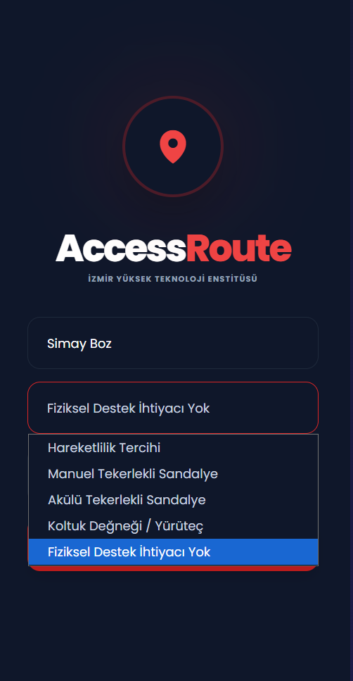
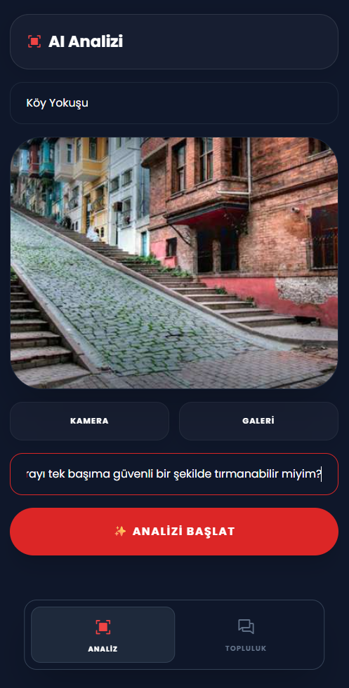
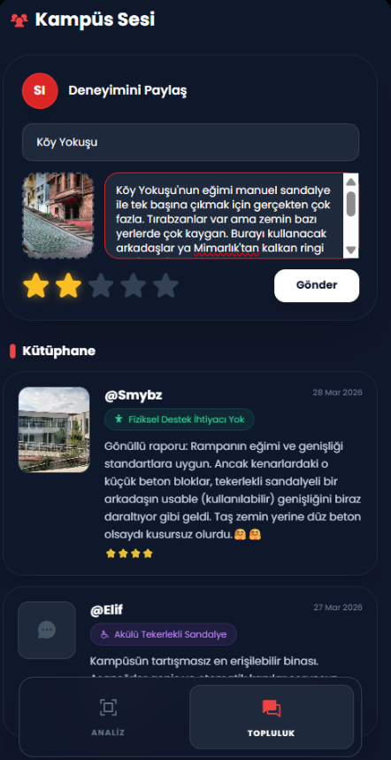
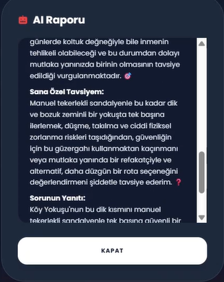

# 🚀 AccessRoute - İYTE Engelsiz Kampüs Asistanı ♿

> **🔗 Uygulama Linki:** [AccessRoute Canlı İzle](https://simayboz.github.io/AccessRoute/) 
> **📺 Demo Videosu:** [Proje Tanıtım ve Kullanım Videosu](https://youtu.be/54USnNLUhws)

**"Görünmez engelleri görünür kılan, topluluk hafızasıyla güçlendirilmiş yapay zeka asistanı."**

---

## 📖 Projenin Hikayesi (Portfolyo)
Her şey İYTE'nin geniş ve engebeli kampüsünde aklıma takılan o basit soruyla başladı: *"Tekerlekli sandalye veya koltuk değneği kullanan bir öğrenci olsaydım, şu an önümdeki rotada beni neyin beklediğini yola çıkmadan nasıl bilebilirdim?"*

Harita uygulamaları bize sadece nereye gideceğimizi söylüyor. Ancak o yoldaki "görünmez engelleri" — dik bir rampayı, arızalı bir asansörü veya aniden başlayan bir inşaatı — gösteremiyordu. Fiziksel engelli bireylerin her gün yaşadığı bu belirsizlik, sadece bir ulaşım sorunu değil; eğitimde ve sosyal hayatta devasa bir fırsat eşitsizliğiydi. İşte **AccessRoute** bu adaletsizliği ortadan kaldırmak için doğdu.

Sadece 10 gün içinde, Cursor ve "Vibe Coding" metodolojisiyle bu projeyi hayata geçirdim. Uygulamanın kalbine Google Gemini 2.5 Flash'ı yerleştirdim. Böylece AccessRoute sadece çekilen fotoğrafı analiz etmekle kalmıyor; aynı zamanda öğrencilerin anlık olarak girdiği "Hazırlık asansörü bozuk" gibi topluluk bildirimlerini de süzgeçten geçirerek kullanıcı profiline özel tavsiyeler sunuyor. 

AccessRoute bir haritadan çok daha fazlası; o, kampüsteki her yolu herkes için eşit, öngörülebilir ve güvenli kılan, topluluk hafızasıyla güçlendirilmiş akıllı bir yol arkadaşı. Geleceğin erişilebilir dünyasını kodlamak, bu süreçteki en büyük gururum oldu.

### 📸 Ekran Görüntüleri

  
  &nbsp;&nbsp;&nbsp;
  
  &nbsp;&nbsp;&nbsp;
  
 

---

## 💡 Problem
İYTE gibi geniş ve engebeli bir kampüste, statik haritalar hareket kısıtlılığı olan öğrenciler için yeterli güvenlik bilgisi sunmamaktadır. Bir rampanın varlığı haritada görünse de; o anki zemin durumu (ıslak mermerin kayganlığı, yaprak birikintisi), anlık başlayan bir inşaat veya bozulan bir asansör gibi **"dinamik engeller"** ancak yerinde görülebilen ve ciddi mağduriyet yaratan faktörlerdir. Bu belirsizlik, eğitimde büyük bir fırsat eşitsizliği yaratır.

## 🎯 Çözüm & 🤖 AI'ın Rolü
AccessRoute, kampüs navigasyonunu basit bir yol tarifinden çıkarıp, yapay zeka destekli bir **"bilişsel karar destek mekanizmasına"** dönüştürür. Projenin kalbinde yer alan **Gemini 2.5 Flash**, şu üç temel katmanda analiz yaparak kullanıcıyı korur:

1. **Kişiselleştirilmiş Görsel Analiz:** Yapay zeka, kullanıcının çektiği fotoğraftaki fiziksel engelleri (eğim, zemin dokusu, basamaklar) analiz eder. Kullanıcının seçtiği profili (Manuel Sandalye, Akülü Sandalye, Koltuk Değneği veya Gönüllü) dikkate alarak sadece o kişiye özel, nokta atışı tavsiyeler üretir.
2. **Kolektif Hafıza Sentezi (Kampüs Sesi):** AI, kameradan gelen canlı görüntüyü Firebase üzerindeki topluluk hafızasıyla harmanlar. Öğrencilerin sisteme girdiği anlık uyarıları (Örn: "Hazırlık asansörü bozuk") okuyarak raporuna entegre eder ve **Öngörülü Güvenlik** sağlar.
3. **İnteraktif NLP Rehberliği:** Kullanıcılar AI'ya "Manuel sandalyemle kışın buradan geçebilir miyim?" gibi doğal dilde özel sorular sorabilir. AI, görseli ve topluluk verisini harmanlayıp kullanıcıya ismiyle hitap ederek net bir yanıt verir.

## 🛠️ Kullanılan Teknolojiler
Bu proje, sadece 10 gün içinde **Cursor IDE** kullanılarak *Vibe Coding* metodolojisiyle geliştirilmiştir.
- **Google Gemini 2.5 Flash:** Multimodal görsel analiz ve bilişsel akıl yürütme (AI Engine).
- **Firebase Firestore:** Gerçek zamanlı topluluk veritabanı (Kampüs Sesi).
- **Vanilla JavaScript (ES6+):** Hafif, hızlı ve mobil cihazlarda ışık hızında çalışan frontend mimarisi.
- **Tailwind CSS & Glassmorphism:** Modern, erişilebilir ve şık kullanıcı arayüzü.
- **HTML5 Canvas API:** İstemci tarafında otomatik görüntü sıkıştırma (performans optimizasyonu).
- **GitHub Pages / Vercel:** Kesintisiz ve hızlı canlı yayın (Deployment).

## 🚀 Nasıl Çalıştırılır?

**1. Doğrudan Tarayıcıda Kullanım (Önerilen):**
Uygulama tamamen mobil uyumlu ve bulut tabanlı olarak çalışmaktadır. Herhangi bir indirme yapmadan, sayfanın en üstündeki **Uygulama Linkine** tıklayarak anında kullanmaya başlayabilirsiniz.

**2. Geliştiriciler İçin Yerel (Local) Kurulum:**
Kaynak kodları bilgisayarınızda çalıştırmak ve incelemek isterseniz:
1. **Repoyu Klonlayın:** `git clone https://github.com/simayboz/AccessRoute.git`
2. **Uygulamayı Açın:** Klonladığınız klasördeki `index.html` dosyasını tarayıcınızda çalıştırın.
3. **API Anahtarı:** AI özelliklerini aktifleştirmek için ilk açılışta ekrandaki alana kendi **Google Gemini API Key**'inizi girin. (Anahtar `LocalStorage`'da güvenle saklanır).

---
**Geliştirici:** Simay Boz(İzmir Yüksek Teknoloji Enstitüsü - Kimya Mühendisliği)