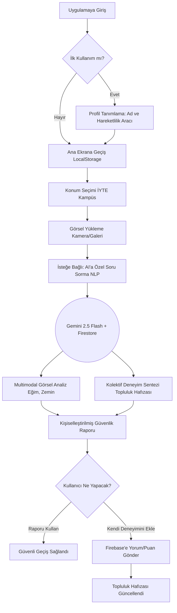

# 🗺️ AccessRoute: Kullanıcı Akışı ve Sistem Diyagramı

Bu belge, bir kullanıcının AccessRoute uygulamasını açtığı andan itibaren kampüste güvenli bir karar verene kadar geçen süreci adım adım ve görsel bir diyagramla açıklar.

## 📊 Sistem İşleyiş Diyagramı

## 1. Giriş ve Kişiselleştirme
* **Karşılama:** Kullanıcı uygulamaya girer ve İYTE temalı modern bir arayüzle karşılaşır.
* **Profil Tanımlama:** Adını girer ve hareketlilik profilini (Manuel Sandalye, Akülü Sandalye, Koltuk Değneği, Beyaz Baston vb.) seçer.
* **Hafıza:** Seçimler ve Gemini API anahtarı `LocalStorage` üzerine kaydedilir, kullanıcı her girişte bu adımı tekrarlamaz.

## 2. Engel Analiz Süreci
* **Konum Seçimi:** Kullanıcı kampüsteki binalardan (örn: Kimya Mühendisliği, Kütüphane) birini seçer.
* **Görsel Girdi:** Kullanıcı, o an karşılaştığı engeli (rampa, merdiven, zemin) kamerayla fotoğraflar veya galeriden yükler.
* **Akıllı Sorgu (NLP):** İsteğe bağlı olarak yapay zekaya "Bu rampadan tek başıma çıkabilir miyim?" gibi profiline özel bir soru ekler.

## 3. Hibrit AI Karar Mekanizması
* **Analiz:** Gemini 2.5 Flash, görseli analiz ederken eş zamanlı olarak Firebase'deki topluluk yorumlarını tarar.
* **Sentez:** Yapay zeka, görsel veriyi ("eğim %12, zemin mermer") ve topluluk verisini ("dün yağmur yağdı, burası şu an çok kaygan") birleştirir.
* **Rapor:** Kullanıcıya kendi hareketlilik profiline özel, risk skorlaması içeren bir "Geçiş Güvenliği Raporu" sunulur.

## 4. Topluluk Etkileşimi ve Geri Bildirim
* **Keşif:** Kullanıcı "Topluluk" sekmesine geçerek o noktadaki diğer tüm fotoğraf ve anlık yorumları okur.
* **Katkı:** Kullanıcı kendi deneyimini (puan ve yorum) sisteme ekler.
* **Süreklilik:** Eklenen bu yeni veri (Experience Synthesis), bir sonraki öğrencinin AI analizini anında daha güçlü ve güvenilir hale getirir.